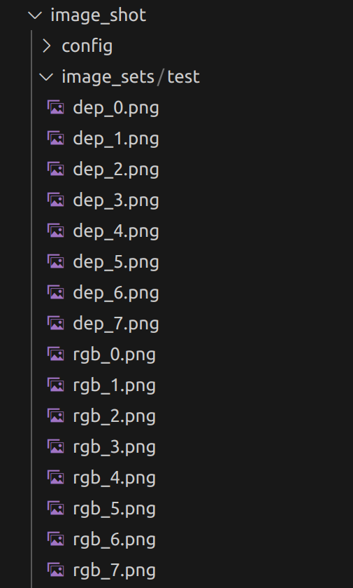

# image_shot
This repository is aimed to capture pictures from a video stream (like web camera, rgbd camera etc.) based on ros topic communication mechnism. 
## Environment and Dependencies
**System environment requirement: Linux + ROS**
  
  Recommanded:
  
  Ubuntu 18.04 - with ROS melodic desktop-full installed or Ubuntu 20.04 - with ROS noetic desktop-full installed (Check resources on [http://ros.org](http://ros.org) for installation guide)

**Library Dependencies: libopencv-dev** 
```
sudo apt-get install libopencv-dev
```

## Download and Build
**Download code**
```
cd rosworkspace/src 
git clone https://github.com/JOYUAGV/image_shot.git
```
**Build**
```
cd ..
catkin_make
```
## Parameters configuration

Here are several parameters in "config/image_shot.yaml" for this pkg needing you to configure correctly to ensure the successfully running!

|Parameter    |Function                       |Default Value|
|-------------|-------------------------------|------------------------|
|rgbTopicName |the topic name of the rgb image |/camera/color/image_raw |
|depthTopicName |the topic name of the depth image |/camera/aligned_depth_to_color/image_raw |
|rgb_prefix |the prefix of the rgb image name |rgb_ |
|depth_prefix |the prefix of the depth image name |dep_ |
|data_set |the name of the captured data sets |test |
|delta_stamp |the time gap for judging the rgb and depth pictures (unit: Sec) |0.001 |
|queue_depth |the queue depth of the subscribing topics |100 |
|control_frequency |the key scanning frequncy for the key capturing (unit: Hz) |50.0 |

## Run
**Before run**

Please start your web camera or rgbd camera and publish the corresponding rgb or depth image topic, here are some examples:

Case 0: Start the web camera (Check resources on [https://github.com/ros-drivers/usb_cam](https://github.com/ros-drivers/usb_cam) for installation guide)
```
roslaunch usb_cam usb_cam_bringup.launch
```
Case 1: Start the rgbd camera (Check resources on [https://github.com/IntelRealSense/realsense-ros](https://github.com/IntelRealSense/realsense-ros) for installation guide)
```
roslaunch realsense2_camera rs_aligned_depth.launch
```
**Launch this node**

Now you can launch this node and press key "ENTER" to capture the corresponding pictures.
```
roslaunch image_shot image_shot.launch
```
**Attention**: Please do click and activate the image window first, and then press key "ENTER" to capture the corresponding pictures!
## Result

Check the capture results in the sub folder "image_shot/image_sets/test"!


